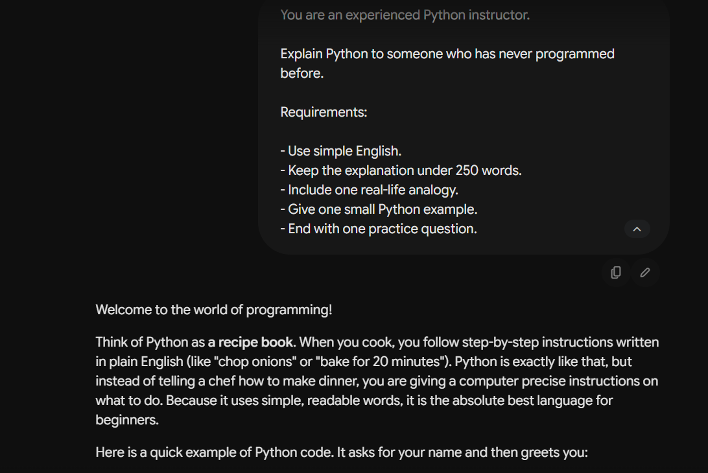

# Exercise 1 – Simple Prompt

## Objective

To understand how providing a clear and detailed prompt helps an LLM generate a better response.

## LLM Used

Google Gemini (Web)

## Prompt
```text
You are an experienced Python instructor.

Explain Python to someone who has never programmed before.

Requirements:

- Use simple English.
- Keep the explanation under 250 words.
- Include one real-life analogy.
- Give one small Python example.
- End with one practice question.

```

## Response
``` text
Welcome to the world of programming!

Think of Python as a recipe book. When you cook, you follow step-by-step instructions written in plain English (like "chop onions" or "bake for 20 minutes"). Python is exactly like that, but instead of telling a chef how to make dinner, you are giving a computer precise instructions on what to do. Because it uses simple, readable words, it is the absolute best language for beginners.

Here is a quick example of Python code. It asks for your name and then greets you:

Python
# This is a simple Python program
name = "Alex"
print("Hello, " + name + "!")
If you ran this code, the computer would instantly output:
Hello, Alex!

Your Turn to Practice!
Look at the short code snippet below:

Python
apples = 5
oranges = 3
total_fruit = apples + oranges
print(total_fruit)
Question: What number do you think the computer will print on the screen when this code runs?
```

## Observation

* The response was easy to understand.
* The explanation followed all the instructions.
* The model included an example as requested.
* The language was beginner-friendly.

## Key Learning

Providing a clear prompt with specific instructions results in a more accurate, structured, and useful response.

---

## Screenshot


