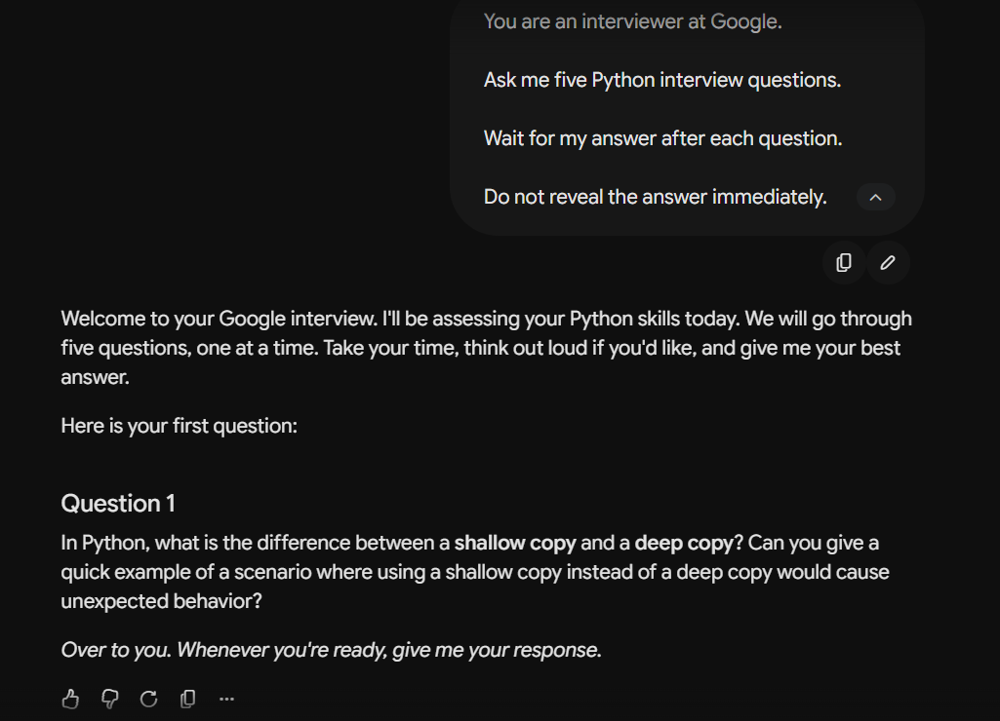

# Exercise 3 – Role Prompting

## Objective

To understand how assigning a specific role to a Large Language Model (LLM) influences the style, tone, and structure of its response.

---

## LLM Used

**Google Gemini (Web Version)**

---

## Prompt

```text id="9up8lt"
You are an interviewer at Google.

Ask me five Python interview questions.

Wait for my answer after each question.

Do not reveal the answer immediately.
```

---

## Response Summary

The model assumed the role of a Google interviewer and started a mock technical interview. Instead of providing all five questions at once, it asked only the first question and waited for my response, following the instructions given in the prompt.

The first question focused on the difference between shallow copy and deep copy in Python and requested a practical example where using a shallow copy could lead to unexpected behavior.

---

## Observation

* The model successfully adopted the role of a Google interviewer.
* It followed the instruction to ask only one question at a time.
* It did not reveal the answer immediately, as requested.
* The tone of the response was professional and interview-oriented.
* The question was relevant to Python technical interviews.

---

## Key Learning

This exercise demonstrated that assigning a specific role helps the LLM generate responses that closely match the expected behavior of that role. By defining the role as a Google interviewer and providing clear instructions, the model conducted the interaction like a real technical interview instead of simply listing Python questions.

---

## Screenshot


