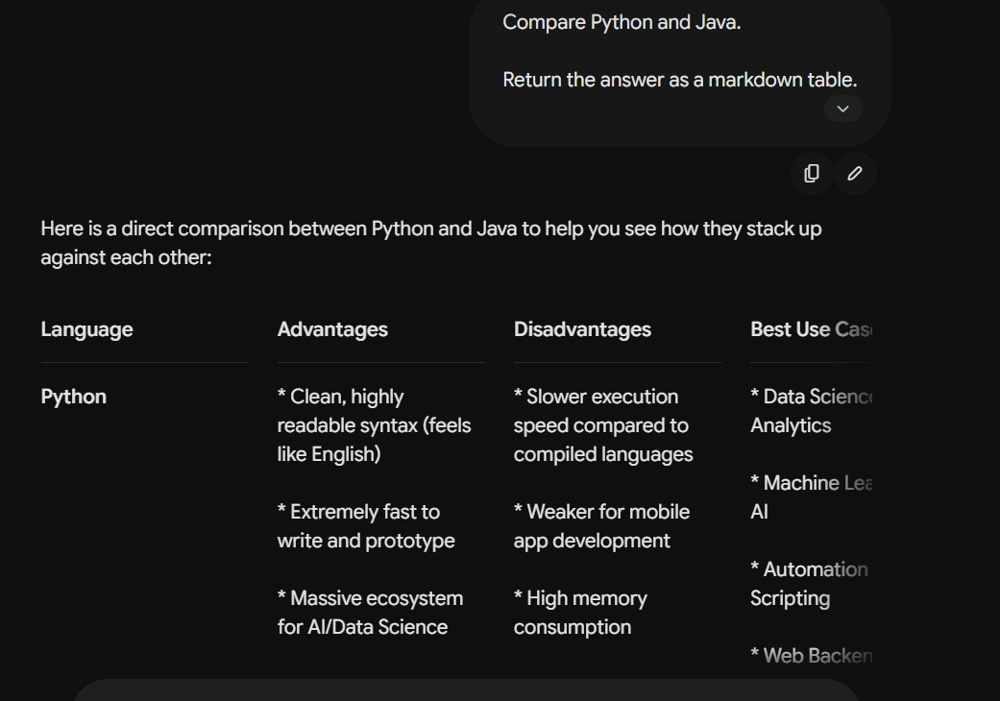

# Exercise 4 – Structured Output Prompting

## Objective

To understand how specifying an output format in a prompt helps a Large Language Model (LLM) generate well-organized and easy-to-read responses.

---

## LLM Used

**Google Gemini (Web Version)**

---

## Prompt

```text id="m1r3kg"
Compare Python and Java.

Return the answer as a markdown table.

Columns:

- Language
- Advantages
- Disadvantages
- Best Use Cases
- Learning Difficulty
```

---

## Response Summary

The model compared Python and Java by presenting the information in a well-structured Markdown table. The response included the advantages, disadvantages, best use cases, and learning difficulty for each programming language, making the comparison clear and easy to understand.

---

## Prompt Engineering Technique Used

**Structured Output Prompting**

---

## Observation

* The model followed the requested output format exactly.
* The comparison was presented as a Markdown table, making it easy to read.
* All the requested columns were included in the response.
* The information was concise, organized, and suitable for quick comparison.
* Using a structured format improved the readability of the response compared to a normal paragraph.

---

## Key Learning

This exercise demonstrated that specifying the desired output format helps the LLM organize information more effectively. Structured Output Prompting is especially useful for comparisons, reports, documentation, summaries, and data presentation because it produces responses that are easier to read and analyze.

---

## Screenshot


