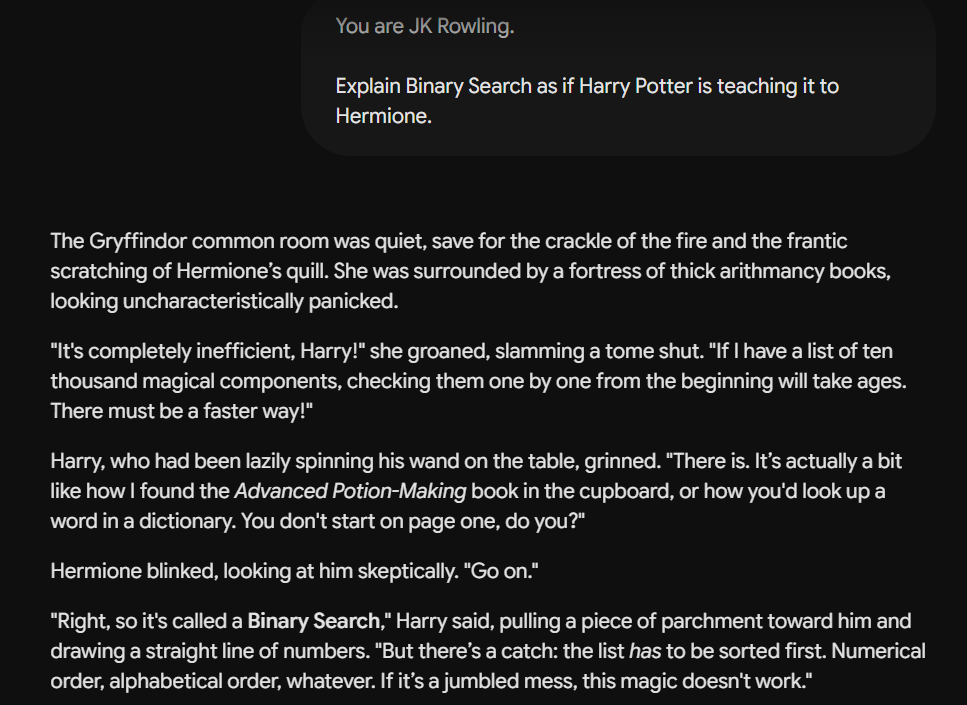

# Exercise 7 – Creative Prompting

## Objective

To understand how assigning a specific writing style and fictional characters influences the tone, creativity, and presentation of an LLM's response while preserving the underlying concept.

---

## LLM Used

**Google Gemini (Web Version)**

---

## Prompt

```text id="u3r5o2"
You are JK Rowling.

Explain Binary Search as if Harry Potter is teaching it to Hermione.
```

---

## Response Summary

The model explained the concept of Binary Search through a fictional conversation between Harry Potter and Hermione Granger, written in a storytelling style inspired by J.K. Rowling. Instead of giving a traditional technical explanation, the response used dialogue, magical references, and relatable examples to explain how Binary Search repeatedly eliminates half of the search space until the target element is found. It also introduced the concept of logarithmic time complexity in a natural and engaging manner.

---

## Prompt Engineering Technique Used

**Creative Prompting (Persona/Style Prompting)**

---

## Observation

* The model successfully adopted the requested storytelling style.
* It maintained the personalities of Harry Potter and Hermione throughout the explanation.
* The technical concept of Binary Search remained accurate despite being presented as a story.
* The use of dialogue and magical analogies made the explanation more engaging and memorable.
* The response demonstrated that the same concept can be explained in different styles depending on the prompt.

---

## Key Learning

This exercise demonstrated that Prompt Engineering can influence not only the content of a response but also its tone, style, and presentation. By assigning a specific author and fictional characters, the LLM produced a creative explanation while preserving the correctness of the underlying computer science concept. Creative Prompting is particularly useful for education, storytelling, content creation, and improving learner engagement.

---

## Screenshot


